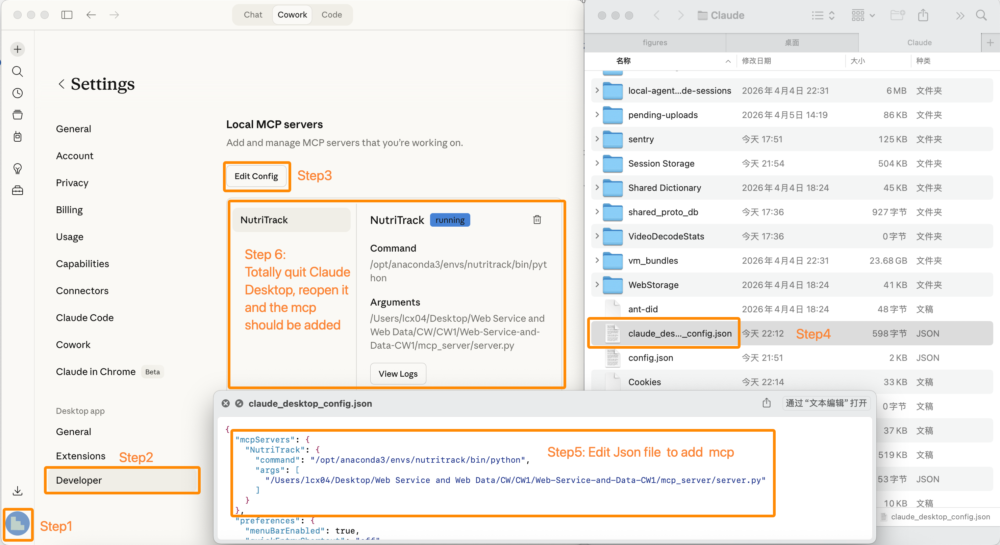
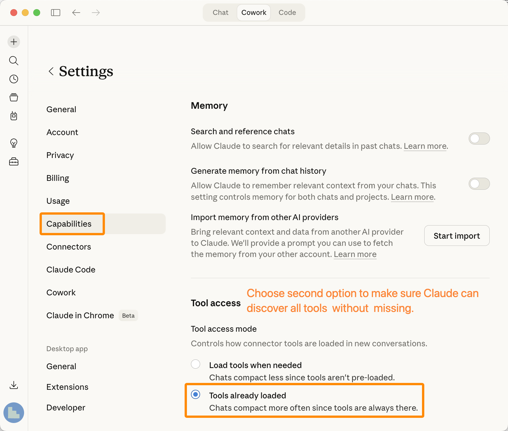
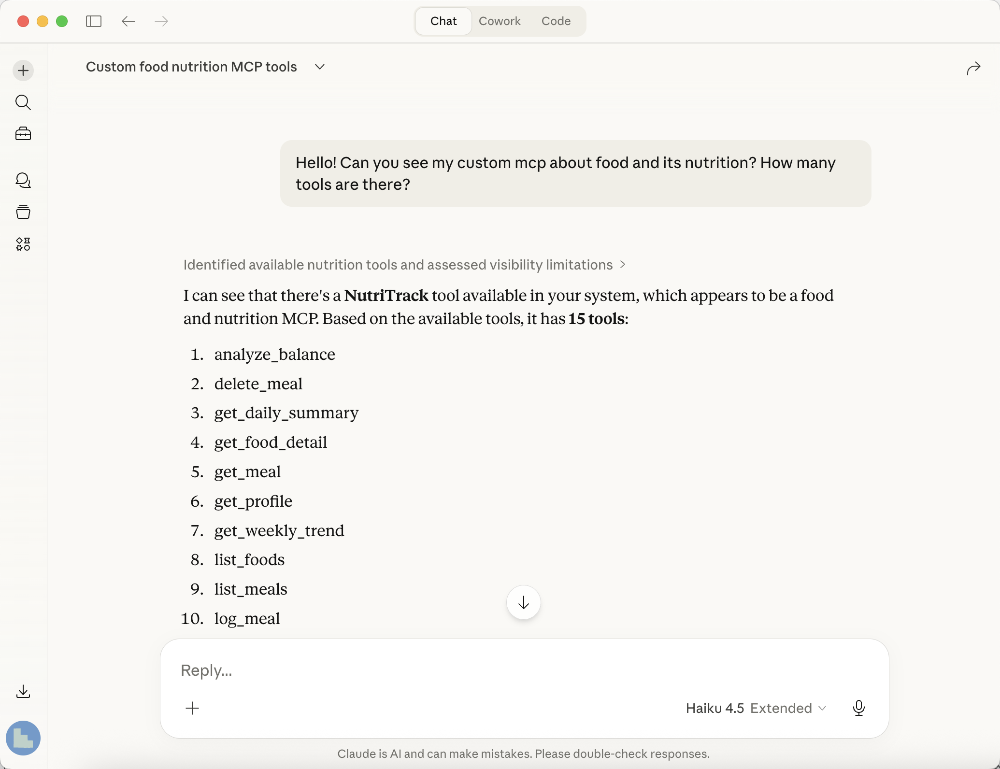

# NutriTrack — Food Nutrition Tracking & Analysis API

A data-driven REST API for food nutrition tracking and dietary analysis, powered by the USDA SR Legacy dataset (7,793 foods). Includes a Model Context Protocol (MCP) server that enables AI assistants (e.g. Claude Desktop) to interact with the API through natural language.

> **Module**: XJCO3011 Web Services and Web Data — Coursework 1

## Features

- **Food Database** — 7,793 foods from USDA SR Legacy with full nutritional data (calories, protein, fat, carbs, fiber per 100g)
- **Meal Tracking** — Log meals with food items and quantities, full CRUD operations
- **Nutrition Analytics** — Daily summaries, weekly trends, and balance analysis against recommended daily intake
- **Personalized Recommendations** — BMR-based daily targets using the Mifflin-St Jeor equation (adjusts for age, gender, height, weight, activity level)
- **Input Validation** — Two-tier validation: hard rejection for impossible values + soft warnings for extreme-but-possible values
- **JWT Authentication** — Secure token-based auth for all user-specific endpoints
- **MCP Integration** — 16 MCP tools wrapping all API endpoints, usable from Claude Desktop, ChatBox, or any MCP-compatible client

## Tech Stack

| Module | Technology |
|--------|-----------|
| Framework | [FastAPI](https://fastapi.tiangolo.com/) |
| Database | SQLite (via aiosqlite) |
| ORM | SQLAlchemy 2.0 (async) |
| Migration | Alembic |
| Auth | JWT (python-jose) |
| MCP | [mcp](https://pypi.org/project/mcp/) (official Python SDK, FastMCP) |
| Data | USDA FoodData Central — SR Legacy (April 2018) |

## Project Structure

```
├── backend/
│   ├── app/
│   │   ├── main.py              # FastAPI entry point
│   │   ├── config.py            # Environment config
│   │   ├── database.py          # SQLAlchemy async engine
│   │   ├── auth/
│   │   │   └── jwt.py           # JWT creation/verification
│   │   ├── models/              # SQLAlchemy models
│   │   │   ├── user.py          # User (with profile fields)
│   │   │   ├── food.py          # Food (USDA nutritional data)
│   │   │   ├── meal.py          # Meal (daily meal records)
│   │   │   └── meal_item.py     # MealItem (food + quantity)
│   │   ├── routers/             # API route handlers
│   │   │   ├── auth.py          # Register, login
│   │   │   ├── foods.py         # Food list, search, detail
│   │   │   ├── meals.py         # Meal CRUD
│   │   │   ├── analytics.py     # Daily/weekly/balance analysis
│   │   │   └── users.py         # User profile get/update
│   │   ├── schemas/             # Pydantic request/response models
│   │   └── data/
│   │       └── import_usda.py   # USDA CSV import script
│   ├── alembic/                 # Database migrations
│   ├── pyproject.toml
│   └── .env                     # Environment variables
├── mcp_server/
│   ├── server.py                # MCP Server (15 tools, stdio mode)
│   └── config.py                # API base URL config
├── dataset/
│   └── sr_legacy/               # USDA SR Legacy CSV files
└── docs/
    ├── api-documentation.md
    ├── technical-report.md
    └── genai-logs/
```

## Quick Start

### Prerequisites

- Python 3.11+ (recommended: 3.12 via conda)
- conda (for environment management)

### 1. Clone & Setup Environment

```bash
git clone <repository-url>
cd Web-Service-and-Data-CW1

# Create conda environment
conda create -n nutritrack python=3.12 -y
conda activate nutritrack

# Install dependencies
cd backend
pip install -e .
pip install python-multipart email-validator bcrypt==4.0.1
```

### 2. Configure Environment Variables

Create a `.env` file in the `backend/` directory:

```bash
# backend/.env
DATABASE_URL=sqlite+aiosqlite:///./nutritrack.db
SECRET_KEY=dev-secret-key-change-in-production
ALGORITHM=HS256
ACCESS_TOKEN_EXPIRE_MINUTES=30
```

> **Note**: The `.env` file is excluded from version control (`.gitignore`). A copy is included in the submission for convenience, so the examiner can run the project without manual configuration. In production, you should generate a secure `SECRET_KEY` and never commit it to a repository.

### 3. Initialize Database & Import Data

```bash
# Run Alembic migrations
cd backend
alembic upgrade head

# Import USDA food data (requires dataset/sr_legacy/ CSV files)
python -m app.data.import_usda
```

This imports 7,793 foods from the USDA SR Legacy dataset into the SQLite database.

### 4. Start the API Server

```bash
cd backend
uvicorn app.main:app --reload --port 8000
```

The API is now available at:
- **API root**: http://127.0.0.1:8000
- **Swagger UI**: http://127.0.0.1:8000/docs
- **ReDoc**: http://127.0.0.1:8000/redoc

## API Endpoints and Swagger

Interactive API documentation is available at **Swagger UI**: `http://127.0.0.1:8000/docs` (when the server is running).

A PDF export of the full API documentation is available at [`docs/api-documentation.pdf`](docs/api-documentation.pdf).

### Authentication (public)

| Method | Endpoint | Description |
|--------|----------|-------------|
| POST | `/api/auth/register` | Register a new user |
| POST | `/api/auth/login` | Login and receive JWT token |

### Foods (public)

| Method | Endpoint | Description |
|--------|----------|-------------|
| GET | `/api/foods/` | List foods (paginated, filterable by category) |
| GET | `/api/foods/categories` | List all food categories |
| GET | `/api/foods/search?q=` | Search foods by name (optional category filter, relevance-ranked) |
| GET | `/api/foods/{id}` | Get food nutritional details |

### Meals (requires auth)

| Method | Endpoint | Description |
|--------|----------|-------------|
| GET | `/api/meals/` | List user's meal records |
| POST | `/api/meals/` | Log a new meal with food items |
| GET | `/api/meals/{id}` | Get meal details |
| PUT | `/api/meals/{id}` | Update a meal |
| DELETE | `/api/meals/{id}` | Delete a meal |

### Analytics (requires auth)

| Method | Endpoint | Description |
|--------|----------|-------------|
| GET | `/api/analytics/daily?date=` | Daily nutritional summary |
| GET | `/api/analytics/weekly?start=` | 7-day nutritional trend |
| GET | `/api/analytics/balance?date=` | Balance analysis vs. recommended intake |

### User Profile (requires auth)

| Method | Endpoint | Description |
|--------|----------|-------------|
| GET | `/api/users/profile` | Get user profile |
| PUT | `/api/users/profile` | Update profile (height, weight, age, etc.) |

### Usage Example

```bash
# Register
curl -X POST http://127.0.0.1:8000/api/auth/register \
  -H "Content-Type: application/json" \
  -d '{"username": "testuser", "email": "test@example.com", "password": "test1234"}'

# Login (get token)
TOKEN=$(curl -s -X POST http://127.0.0.1:8000/api/auth/login \
  -d "username=testuser&password=test1234" | python3 -c "import sys,json; print(json.load(sys.stdin)['access_token'])")

# Search foods
curl "http://127.0.0.1:8000/api/foods/search?q=chicken+breast"

# Log a meal
curl -X POST http://127.0.0.1:8000/api/meals/ \
  -H "Authorization: Bearer $TOKEN" \
  -H "Content-Type: application/json" \
  -d '{"meal_type": "lunch", "date": "2026-04-09", "items": [{"food_id": 1, "quantity": 200}]}'

# Get daily summary
curl -H "Authorization: Bearer $TOKEN" \
  "http://127.0.0.1:8000/api/analytics/daily?date=2026-04-09"
```

## MCP Server Setup

The MCP server wraps all API endpoints as 16 tools, enabling AI assistants to interact with NutriTrack through natural language conversation.

### Claude Desktop Configuration

> **Important**: Claude's MCP support is only available on the **Desktop app** (macOS/Windows). The web version (claude.ai) and mobile apps do **not** support custom MCP servers.

1. **Ensure the API server is running** (see Quick Start step 4)

2. **Open MCP config in Claude Desktop**:
   - Click your profile icon → **Settings** → **Developer** → **Edit Config**
   - This opens `claude_desktop_config.json` in your editor

3. **Add the NutriTrack MCP server** to the JSON config:

```json
{
  "mcpServers": {
    "NutriTrack": {
      "command": "/opt/anaconda3/envs/nutritrack/bin/python",
      "args": ["/absolute/path/to/Web-Service-and-Data-CW1/mcp_server/server.py"]
    }
  }
}
```

> Replace `/absolute/path/to/` with the actual path on your machine, and adjust the Python path if your conda is installed elsewhere. You can find the Python path by running `which python` in your conda environment.



4. **Restart Claude Desktop** (fully quit and reopen)

5. **Enable tool access**: Go to **Settings** → **Capabilities** → **Tool Access**, and select **"Tools already loaded"** instead of "Load tools when needed", to prevent tools from being missed due to on-demand discovery.



6. **Test it** — In a new Claude conversation, Claude should discover all 16 NutriTrack tools. Try:
   - "Search for foods containing 'apple'"
   - "Login with testuser / test1234, then show my daily nutrition summary for today"
   - "Log a breakfast: 2 eggs (100g each) and a banana (120g)"



### MCP Demo Video

A video walkthrough demonstrating the MCP integration with Claude Desktop is available:

- **OneDrive (University login required)**: [Nutritrack MCP Test.mp4](https://leeds365-my.sharepoint.com/:v:/g/personal/sc222cl_leeds_ac_uk/IQAh4GVjmN3KRK-DVC8xJabmAUbIeYS8jT3dkmSnX4JH6dg?e=OM1BBh)
- **OneDrive (Public, expires 10 May 2026)**: [Nutritrack MCP Test.mp4](https://leeds365-my.sharepoint.com/:v:/g/personal/sc222cl_leeds_ac_uk/IQAh4GVjmN3KRK-DVC8xJabmAa6zerInpmek1mNiET-s8A8?e=wwAIbx) *(University OneDrive enforces a 30-day expiration policy on anonymous sharing links)*
- **Google Drive**: [Nutritrack MCP Test.mp4](https://drive.google.com/file/d/1UspzW6NKdCV6bREEXfJEeEzfvv2kEZGd/view?usp=drive_link)
- **Baidu Pan**: [Nutritrack MCP Test.mp4](https://pan.baidu.com/s/1vxoabSBIEFR8bu7B1R98BQ?pwd=q3md) (Password: q3md)

### MCP Conversation Export

A PDF export of a real conversation with Claude Desktop using NutriTrack MCP tools is available in [`docs/Nutritrack MCP Test by Claude Desktop.pdf`](docs/Nutritrack%20MCP%20Test%20by%20Claude%20Desktop.pdf).

> **Note**: Due to limitations of the export tool, the model's thinking process and raw tool call details are not visible in the PDF. Please refer to the demo video above for the full interactive experience.

### Available MCP Tools (16)

| Tool | Auth Required | Description |
|------|:---:|-------------|
| `register` | No | Register a new account |
| `login` | No | Login and store JWT token |
| `list_categories` | No | List all food categories |
| `search_food` | No | Search foods by name (with optional category filter) |
| `list_foods` | No | List foods with pagination/filtering |
| `get_food_detail` | No | Get detailed nutrition for a food |
| `log_meal` | Yes | Record a meal with food items |
| `list_meals` | Yes | View meal history |
| `get_meal` | Yes | View a specific meal |
| `update_meal` | Yes | Modify a meal record |
| `delete_meal` | Yes | Remove a meal record |
| `get_daily_summary` | Yes | Daily calorie & macro totals |
| `get_weekly_trend` | Yes | 7-day nutrition trend |
| `analyze_balance` | Yes | Compare intake vs. recommended values |
| `get_profile` | Yes | View user profile |
| `update_profile` | Yes | Update height, weight, age, etc. |

## Data Source

- **USDA FoodData Central — SR Legacy** (April 2018)
- 7,793 common foods with nutritional data per 100g
- 28 food categories (Dairy, Poultry, Fruits, Vegetables, etc.)
- Source: https://fdc.nal.usda.gov/download-datasets

## Documentation

- [API Documentation (PDF)](docs/api-documentation.pdf)
- [Technical Report](docs/technical-report.md)
- [GenAI Usage Logs](docs/genai-logs/)

## License

This project is for academic purposes (XJCO3011 Coursework 1).