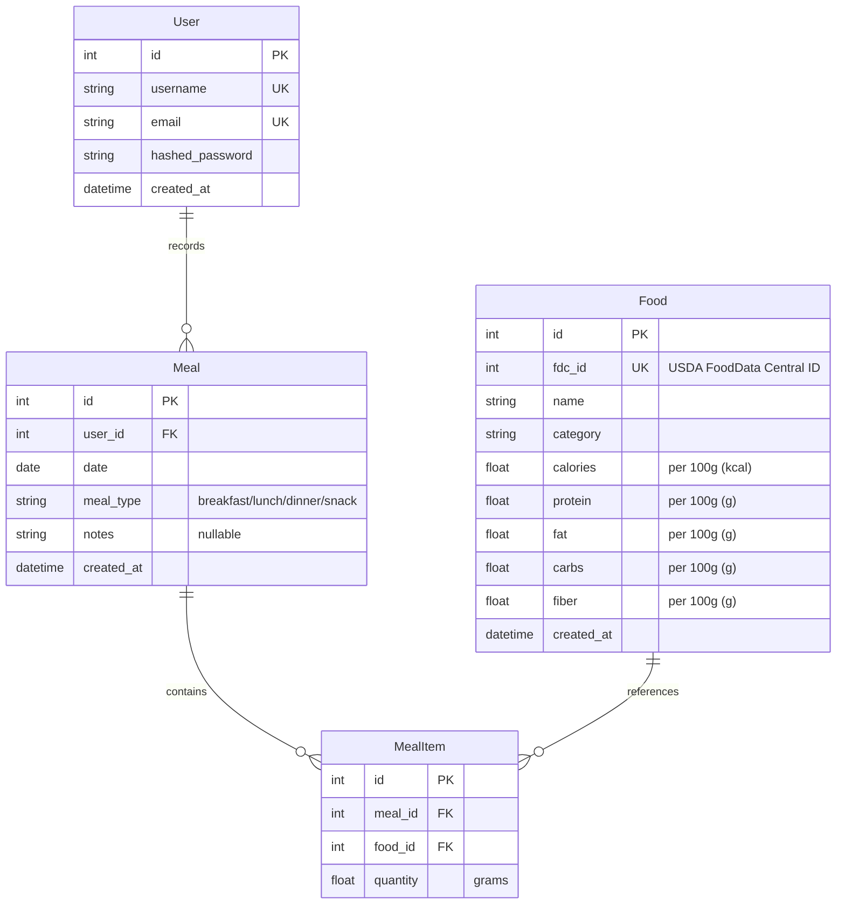

# NutriTrack - 食品营养追踪 API 实施计划

> 项目名称暂定 **NutriTrack**，可后续更改。

## 0. 项目概述

一个食品营养追踪与分析平台，包含：
- **Part 1**：RESTful API（FastAPI + SQLite）— 食品数据 CRUD、饮食记录、营养分析
- **Part 2**：MCP Server — 将 API 封装为 MCP 工具，供任何 MCP 客户端（Claude Desktop / ChatBox 等）调用

---

## 1. 技术栈

| 层 | 技术 | 理由 |
|---|---|---|
| 后端框架 | FastAPI | 自带 Swagger、异步原生、类型注解即文档 |
| 数据库 | SQLite | 零配置，演示友好 |
| ORM | SQLAlchemy (async) | Python 行业标准，支持异步 |
| 数据库迁移 | Alembic | SQLAlchemy 配套的迁移工具 |
| 认证 | JWT (python-jose) | JWT 用于 API 认证 |
| MCP | mcp (官方 Python SDK) | 与后端同语言，无缝衔接 |
| 包管理 | conda + pip | conda 管理 Python 环境（nutritrack, Python 3.12），pip 安装依赖 |

---

## 2. 数据模型设计

### 2.1 ER 关系



### 2.2 表结构

#### User（用户）

| 字段 | 类型 | 说明 |
|---|---|---|
| id | int PK | 自增主键 |
| username | string UNIQUE | 用户名 |
| email | string UNIQUE | 邮箱 |
| hashed_password | string | 密码哈希 |
| created_at | datetime | 创建时间 |

#### Food（食品）

| 字段 | 类型 | 说明 |
|---|---|---|
| id | int PK | 自增主键 |
| fdc_id | int UNIQUE NULL | USDA FoodData Central ID（用于溯源） |
| name | string | 食品名称 |
| category | string | 分类（来自 USDA food_category） |
| calories | float | 每100g热量(kcal) |
| protein | float | 蛋白质(g) |
| fat | float | 脂肪(g) |
| carbs | float | 碳水化合物(g) |
| fiber | float | 膳食纤维(g) |
| created_at | datetime | 创建时间 |

#### Meal（餐食记录）

| 字段 | 类型 | 说明 |
|---|---|---|
| id | int PK | 自增主键 |
| user_id | int FK→User | 所属用户 |
| date | date | 日期 |
| meal_type | string | 餐次 (breakfast/lunch/dinner/snack) |
| notes | string NULL | 备注 |
| created_at | datetime | 创建时间 |

#### MealItem（餐食明细）
| 字段 | 类型 | 说明 |
|---|---|---|
| id | int PK | 自增主键 |
| meal_id | int FK→Meal | 所属餐食 |
| food_id | int FK→Food | 食品 |
| quantity | float | 数量(g) |

---

## 3. API 端点设计

### 3.1 认证 (Auth)

| 方法 | 端点 | 说明 |
|---|---|---|
| POST | `/api/auth/register` | 用户名密码注册 |
| POST | `/api/auth/login` | 用户名密码登录，返回 JWT |
| GET | `/api/auth/me` | 获取当前登录用户信息 |

### 3.2 食品 (Foods) — 只读查询

| 方法 | 端点 | 说明 | 认证 |
|---|---|---|---|
| GET | `/api/foods/` | 获取食品列表（支持分页、过滤） | 可选 |
| GET | `/api/foods/{id}` | 获取单个食品详情 | 可选 |
| GET | `/api/foods/search?q=` | 搜索食品 | 可选 |

### 3.3 饮食记录 (Meals) — 核心 CRUD

| 方法 | 端点 | 说明 | 认证 |
|---|---|---|---|
| GET | `/api/meals/` | 获取当前用户的餐食列表 | 需要 |
| GET | `/api/meals/{id}` | 获取单条餐食详情（含明细） | 需要 |
| POST | `/api/meals/` | 创建一条餐食记录 | 需要 |
| PUT | `/api/meals/{id}` | 更新餐食记录 | 需要 |
| DELETE | `/api/meals/{id}` | 删除餐食记录 | 需要 |

### 3.4 营养分析 (Analytics) — 加分端点

| 方法 | 端点 | 说明 | 认证 |
|---|---|---|---|
| GET | `/api/analytics/daily?date=` | 某天的营养摄入汇总 | 需要 |
| GET | `/api/analytics/weekly?start=` | 一周营养趋势 | 需要 |
| GET | `/api/analytics/balance?date=` | 营养均衡评估（与推荐值对比） | 需要 |

### 3.5 用户 (Users)

| 方法 | 端点 | 说明 | 认证 |
|---|---|---|---|
| GET | `/api/users/profile` | 获取个人资料 | 需要 |
| PUT | `/api/users/profile` | 更新个人资料 | 需要 |

---

## 4. MCP Server 设计

### 4.1 封装的 Tools（15 个）

| Tool 名称 | 对应 API | 说明 |
|---|---|---|
| `login` | POST /api/auth/login | 登录并获取 JWT |
| `register` | POST /api/auth/register | 注册新用户 |
| `get_profile` | GET /api/users/profile | 获取个人资料 |
| `update_profile` | PUT /api/users/profile | 更新个人资料（身高/体重/年龄等） |
| `search_food` | GET /api/foods/search | 搜索食品 |
| `list_foods` | GET /api/foods/ | 浏览食品列表（分页/分类过滤） |
| `get_food_detail` | GET /api/foods/{id} | 获取食品详情 |
| `log_meal` | POST /api/meals/ | 记录一餐 |
| `list_meals` | GET /api/meals/ | 查看餐食列表 |
| `get_meal` | GET /api/meals/{id} | 查看单条餐食详情 |
| `update_meal` | PUT /api/meals/{id} | 更新餐食记录 |
| `delete_meal` | DELETE /api/meals/{id} | 删除餐食记录 |
| `get_daily_summary` | GET /api/analytics/daily | 每日营养汇总 |
| `get_weekly_trend` | GET /api/analytics/weekly | 一周趋势 |
| `analyze_balance` | GET /api/analytics/balance | 营养均衡评估（个性化） |

### 4.2 运行方式

- **stdio 模式**：供 Claude Desktop / ChatBox 等客户端通过 JSON 配置连接
- **SSE 模式**：可选，供远程客户端通过 HTTP 连接

### 4.3 演示方案

- **Swagger UI**：API 本身的测试和展示（浏览器直接访问 `/docs`）
- **Claude Desktop / ChatBox**：通过 MCP 连接，现场演示 AI 对话调用 API
- **演示视频**：录制完整演示流程，附在 README 中
- **多平台使用指南**：README 中提供 Claude Desktop 和 ChatBox 的配置方法

---

## 6. 数据集

**USDA FoodData Central — SR Legacy (April 2018)** — 美国农业部标准参考食品营养数据库，最终版。

- 来源：`https://fdc.nal.usda.gov/download-datasets` → SR Legacy → April 2018 (CSV)
- 食品数量：7793 种
- 分类数量：28 个（Dairy, Poultry, Fruits, Vegetables 等）
- 已下载至：`dataset/FoodData_Central_sr_legacy_food_csv_2018-04.zip`

核心文件与字段映射：

| CSV 文件 | 用途 | 关键字段 |
|---|---|---|
| food.csv | 食品列表 | fdc_id, description, food_category_id |
| food_category.csv | 分类 | id, description |
| food_nutrient.csv | 营养数据（644125 条） | fdc_id, nutrient_id, amount |
| nutrient.csv | 营养素定义 | id, name, unit_name |

扁平化导入映射（nutrient_id → Food 表字段）：

| nutrient_id | 营养素 | 对应 Food 字段 |
|---|---|---|
| 1008 | Energy (KCAL) | calories |
| 1003 | Protein (G) | protein |
| 1004 | Total lipid/fat (G) | fat |
| 1005 | Carbohydrate, by difference (G) | carbs |
| 1079 | Fiber, total dietary (G) | fiber |

导入计划：
1. 读 food.csv + food_category.csv → Food 表（name, category）
2. 从 food_nutrient.csv 按上述 5 个 nutrient_id 筛选 → 扁平化写入 Food 表
3. 导入脚本位于 `backend/app/data/import_usda.py`

---

## 7. 项目目录结构

```
Web-Service-and-Data-CW1/
├── README.md
├── docs/
│   ├── api-documentation.md       → 导出 PDF
│   ├── api-documentation.pdf
│   ├── technical-report.md        → 导出 PDF
│   ├── technical-report.pdf
│   ├── presentation.md            → 制作 PPT
│   ├── presentation.pptx
│   ├── agent-docs/
│   │   ├── plan.md                ← 本文件
│   │   └── architecture.md        ← 架构决策记录
│   └── genai-logs/
│       └── ...
│
├── backend/
│   ├── pyproject.toml             ← 依赖管理
│   ├── alembic/                   ← 数据库迁移
│   ├── app/
│   │   ├── main.py                ← FastAPI 入口
│   │   ├── config.py              ← 配置（环境变量）
│   │   ├── database.py            ← 数据库连接
│   │   ├── models/                ← SQLAlchemy 模型
│   │   │   ├── user.py
│   │   │   ├── food.py
│   │   │   ├── meal.py
│   │   │   └── meal_item.py
│   │   ├── schemas/               ← Pydantic 请求/响应模型
│   │   │   ├── user.py
│   │   │   ├── food.py
│   │   │   ├── meal.py
│   │   │   └── analytics.py
│   │   ├── routers/               ← API 路由
│   │   │   ├── auth.py
│   │   │   ├── foods.py
│   │   │   ├── meals.py
│   │   │   ├── analytics.py
│   │   │   └── users.py
│   │   ├── services/              ← 业务逻辑
│   │   │   ├── auth_service.py
│   │   │   ├── food_service.py
│   │   │   ├── meal_service.py
│   │   │   ├── analytics_service.py
│   │   │   └── user_service.py
│   │   ├── auth/                  ← 认证相关
│   │   │   └── jwt.py
│   │   └── data/                  ← 数据导入
│   │       ├── import_usda.py
│   │       └── usda_subset.csv
│   ├── .env.example               ← 环境变量模板
│   └── tests/
│       └── ...
│
└── mcp_server/
    ├── server.py                  ← MCP Server 入口
    ├── tools.py                   ← Tool 定义
    └── config.py                  ← MCP 配置
```

---

## 8. 实施阶段与时间线

### Phase 1: 基础搭建 ✅

- [x] 初始化 FastAPI 项目、安装依赖（conda env: nutritrack, Python 3.12）
- [x] 配置 SQLAlchemy + SQLite + Alembic（render_as_batch=True）
- [x] 定义所有数据模型 (User, Food, Meal, MealItem)
- [x] 运行第一次数据库迁移（136b09469b18_initial_tables）
- [x] 验证：`uvicorn app.main:app` 能启动，`/docs` 能访问

### Phase 2: 核心 CRUD ✅

- [x] 实现 Food 只读端点（GET 列表/详情/搜索 + 分页、分类过滤）
- [x] 实现 Meal + MealItem 完整 CRUD（POST/GET/PUT/DELETE）
- [x] 添加分页、过滤、排序
- [ ] 编写基本测试
- [x] 验证：Swagger UI 上能完整增删改查

### Phase 3: 认证系统 ✅

- [x] 实现 JWT 认证（注册/登录/token 验证）
- [x] 给需要认证的端点加上依赖
- [x] 验证：能用 JWT 访问受保护端点

### Phase 4: 营养分析端点 ✅

- [x] 实现每日营养汇总（daily）
- [x] 实现每周趋势（weekly，7 天分组 + 平均值）
- [x] 实现营养均衡评估（balance）
- [x] 添加用户个人信息（身高/体重/年龄/性别/活动水平）
- [x] 实现 Mifflin-St Jeor BMR 个性化推荐值计算（替代固定 FDA 值）
- [x] GET/PUT /api/users/profile 端点
- [x] 验证：个性化推荐值正确（175cm/70kg/22岁/男/中等 → 2617.6 kcal）

### Phase 5: 数据导入 ✅

- [x] 下载 USDA SR Legacy 完整数据集（7793 种食品）
- [x] 编写导入脚本（`backend/app/data/import_usda.py`）
- [x] 导入全部 7793 种食品 + 5 种营养素数据
- [x] 验证：数据准确（鸡蛋 143 kcal / 12.56g 蛋白质等，28 个分类完整）

### Phase 6: MCP Server ✅

- [x] 用 mcp SDK (FastMCP) 创建 MCP Server（mcp_server/server.py）
- [x] 封装 15 个 tools：完整覆盖所有 API 端点
  - Auth: login, register
  - Profile: get_profile, update_profile
  - Foods: search_food, list_foods, get_food_detail
  - Meals: log_meal, list_meals, get_meal, update_meal, delete_meal
  - Analytics: get_daily_summary, get_weekly_trend, analyze_balance
- [x] 测试 stdio 模式 + Claude Desktop 连接
- [x] 验证：Claude Desktop 成功调用全部工具

### Phase 7: 演示准备

- [ ] 录制演示视频（Swagger UI 操作 + MCP 客户端 AI 对话）
- [ ] 在 README 中编写 Claude Desktop 配置指南
- [ ] 在 README 中编写 ChatBox 配置指南
- [ ] 验证：按照 README 指南从零配置能跑通

### Phase 8: 文档与收尾

- [ ] 导出 Swagger 为 API 文档 PDF
- [ ] 撰写技术报告（5 页）
- [ ] 制作演示 PPT
- [ ] 整理 GenAI 对话记录
- [ ] 完善 README.md
- [ ] 最终检查：代码可运行、所有文档齐全
- [ ] 准备口头答辩（预演 5 分钟展示 + 预想 Q&A）

---

## 9. 风险与备选方案

| 风险 | 影响 | 备选方案 |
|---|---|---|
| USDA 数据集处理耗时 | 延误 Phase 5 | 先手动录入 50 条常见食品，后续补充 |
| MCP 客户端连接问题 | 演示受阻 | 提前录好演示视频作为备份 |

**核心原则：Phase 1-4 是及格线，必须优先保证。Phase 5-6 是加分项，Phase 7-8 是收尾。**

---

## 10. 答辩要点准备

考官可能问的问题：

1. "为什么选 FastAPI 而不是 Django？"
2. "你的认证是怎么设计的？JWT 是怎么工作的？"
3. "MCP 是什么？和直接调 API 有什么区别？"
4. "你的营养分析是怎么算的？"
5. "AI 是怎么知道调用哪个工具的？"
6. "你如何使用了 GenAI？它在哪些地方帮了你？"
7. "如果数据量变大，你的架构需要怎么调整？"

每一个在实施过程中都要积累答案。
