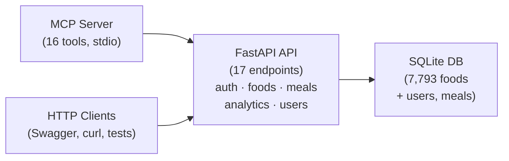
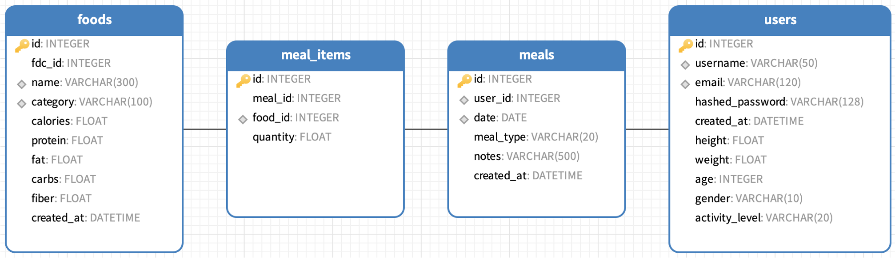

# Technical Report — NutriTrack

> **Module**: XJCO3011 Web Services and Web Data — Coursework 1
> **Author**: Chenxi Li
> **Date**: April 2026

**Links:**

- **GitHub Repository**: https://github.com/lcx-0504/Web-Service-and-Data-CW1
- **Commit History (16 commits)**: https://github.com/lcx-0504/Web-Service-and-Data-CW1/commits/main
- **Live API (PythonAnywhere)**: https://lichenxi.pythonanywhere.com
- **Swagger UI**: https://lichenxi.pythonanywhere.com/docs
- **ReDoc**: https://lichenxi.pythonanywhere.com/redoc
- **API Documentation (PDF)**: https://github.com/lcx-0504/Web-Service-and-Data-CW1/blob/main/docs/api-documentation.pdf
- **Technical Report (PDF)**: https://github.com/lcx-0504/Web-Service-and-Data-CW1/blob/main/docs/technical-report.pdf
- **Presentation Slides**: [Online PDF](https://github.com/lcx-0504/Web-Service-and-Data-CW1/blob/main/docs/presentation.pdf) | [Download PPTX](https://github.com/lcx-0504/Web-Service-and-Data-CW1/raw/main/docs/presentation.pptx)
- **GenAI Logs**: https://github.com/lcx-0504/Web-Service-and-Data-CW1/tree/main/docs/genai-logs
- **MCP Server (16 tools)**: https://github.com/lcx-0504/Web-Service-and-Data-CW1/blob/main/mcp_server/server.py
- **Integration Tests (28 tests)**: https://github.com/lcx-0504/Web-Service-and-Data-CW1/blob/main/backend/tests/test_api.py
- **Test Results Log (28 passed)**: https://github.com/lcx-0504/Web-Service-and-Data-CW1/blob/main/docs/test-results.txt

## 1. Project Overview

NutriTrack is a data-driven REST API for food nutrition tracking and dietary analysis. It integrates the USDA FoodData Central SR Legacy dataset (7,793 foods across 25 categories) and provides comprehensive functionality including:

- **Food search and browsing** with relevance-ranked results, category filtering, and pagination
- **Meal logging** with full CRUD operations, linking food items with quantities in grams
- **Nutritional analytics** — daily summaries, 7-day trends, and balance analysis against recommended daily intake
- **Personalised recommendations** — BMR-based daily targets calculated using the Mifflin-St Jeor equation, adjusted for user-specific age, gender, height, weight, and activity level
- **Two-tier input validation** — hard rejection for impossible values (e.g., negative weight) plus soft warnings for extreme-but-possible values (e.g., 130 kg)
- **MCP (Model Context Protocol) integration** — 16 tools wrapping all API endpoints, enabling AI assistants (e.g., Claude Desktop) to interact with the system via natural language

The API is deployed on PythonAnywhere (https://lichenxi.pythonanywhere.com) and includes 28 automated integration tests.

## 2. Technology Stack Justification

| Component | Choice | Justification |
|-----------|--------|---------------|
| **Framework** | FastAPI | Chosen over Django for its lightweight design, native async support, automatic OpenAPI/Swagger documentation generation, and built-in Pydantic validation. Since this project is a pure API without server-rendered pages, FastAPI's focused feature set is a better fit than Django's full-stack approach. |
| **Database** | SQLite | Sufficient for a single-user coursework project with ~7,800 records. Zero-configuration, portable (single file), and supports concurrent reads. Avoids the operational overhead of PostgreSQL or MySQL. |
| **ORM** | SQLAlchemy 2.0 | Mature, well-documented ORM with support for complex queries (e.g., `case()` expressions for relevance sorting). Pairs with Alembic for schema migrations, ensuring database changes are tracked and reproducible. |
| **Authentication** | JWT (python-jose) | Stateless token-based auth aligns well with RESTful API principles. No server-side session storage required. Token expiration enforces security without added complexity. |
| **MCP Server** | mcp SDK (FastMCP) | The official Python MCP SDK provides a clean decorator-based API for defining tools. Using stdio transport mode keeps the architecture simple and avoids additional network configuration. This enables AI assistants to interact with the entire API through natural language. |
| **Deployment** | PythonAnywhere | Free-tier hosting suitable for coursework demonstration. Required a custom ASGI-to-WSGI bridge since PythonAnywhere only supports WSGI (uWSGI), while FastAPI is an ASGI framework. |

## 3. Architecture & Design Decisions

### System Architecture

The system follows a three-layer architecture:

### Data Model Design

Four SQLAlchemy models with the following relationships:

- **User** → has many **Meals** (one-to-many)
- **Meal** → has many **MealItems** (one-to-many, cascade delete)
- **MealItem** → references one **Food** (many-to-one)
- **Food** — standalone entity populated from USDA import

This design separates the static food reference data from user-generated meal records, allowing efficient queries for analytics.

**Relationships:** User 1 - N Meal (one user has many meals) · Meal 1 - N MealItem (one meal contains many items) · Food 1 - N MealItem (one food appears in many items) · **Food N - N Meal** (many-to-many via MealItem junction table)

### Key Design Decisions

1. **Relevance-ranked search**: Food search results are sorted by relevance using SQL `CASE` expressions — names starting with the query rank highest, followed by substring matches. This significantly improves the user experience for common queries.

2. **Two-tier validation**: Rather than silently accepting or rigidly rejecting edge-case inputs, the API returns soft warnings for unusual (but valid) values. For example, setting weight to 130 kg is accepted but returns a warning: *"Weight 130.0 kg is unusually high. Please verify."*

3. **Personalised BMR calculation**: The balance analysis endpoint uses the Mifflin-St Jeor equation when user profile data is available, falling back to generic daily values (2,000 kcal) otherwise. This enables personalised dietary recommendations without requiring all users to complete their profile.

4. **Synchronous database operations**: The codebase was initially built with async SQLAlchemy (aiosqlite) but was converted to synchronous operations to support deployment on PythonAnywhere, which runs uWSGI without threading support.

## 4. Challenges & Lessons Learned

### PythonAnywhere Deployment (ASGI/WSGI Bridge)

The most significant challenge was deploying FastAPI on PythonAnywhere. FastAPI is an ASGI framework, but PythonAnywhere only supports WSGI via uWSGI. The resolution process involved three iterations:

1. **Direct WSGI call** — Failed with `TypeError: FastAPI.__call__() missing 1 required positional argument: 'send'` because ASGI apps require a three-argument protocol (`scope`, `receive`, `send`).
2. **a2wsgi adapter** — Installed the third-party `a2wsgi` package, which bridges ASGI to WSGI using threading. However, all requests hung for 20+ seconds and timed out (HTTP 499), because uWSGI on PythonAnywhere has Python threading disabled.
3. **Custom WSGI bridge** — Wrote a manual ASGI-to-WSGI bridge that constructs an ASGI scope from the WSGI environ, creates `receive()`/`send()` coroutines, and calls the FastAPI app via `asyncio.new_event_loop().run_until_complete()`. This avoids threading entirely and works correctly.

**Lesson**: Cloud platform constraints (e.g., disabled threading) can invalidate standard library solutions. Understanding the underlying protocol (ASGI vs WSGI) was essential for debugging.

### bcrypt Compatibility

The `passlib` library, used for password hashing, is incompatible with `bcrypt >= 5.0` due to a removed internal API (`bcrypt.__about__`). This caused `AttributeError` at runtime despite successful installation. The fix was to pin `bcrypt==4.2.1` in `requirements.txt`.

**Lesson**: Dependency version conflicts require careful pinning, especially for security-critical libraries.

### Async-to-Sync Conversion

Converting 7 files from async to sync SQLAlchemy involved: replacing `create_async_engine` with `create_engine`, `AsyncSession` with `Session`, removing all `await` keywords, and changing the database URL driver from `sqlite+aiosqlite` to `sqlite`. While mechanically straightforward, this required touching every route handler and the authentication middleware.

**Lesson**: Starting with the deployment target's constraints in mind would have avoided this rework.

### Testing Strategy

The project includes 28 automated integration tests (`backend/tests/test_integration.py`) that verify the full request-response cycle against a running API instance. The test suite uses `httpx` as the HTTP client and supports a **configurable base URL** — by setting the `TEST_BASE_URL` environment variable, the same tests can run against both the local development server (`http://127.0.0.1:8000`) and the production deployment (`https://lichenxi.pythonanywhere.com`).

The tests are organised into five groups covering: user registration and login, food listing/searching/detail, meal CRUD (create, read, update, delete), analytics endpoints (daily summary, weekly trend, balance analysis), and user profile management. Each test group creates its own isolated user to avoid cross-test interference. Key edge cases tested include: duplicate username registration (expects 400), accessing meals that belong to other users (expects 404), searching with empty queries (expects 422), and logging meals with future dates (expects 422).

### Data Source

The food nutritional data is sourced from the **USDA FoodData Central — SR Legacy** dataset (April 2018), published by the U.S. Department of Agriculture. The dataset contains 7,793 common foods across 25 categories, with per-100g values for energy, protein, fat, carbohydrates, and fibre. It is publicly available at https://fdc.nal.usda.gov/download-datasets under a U.S. Government public domain licence.

## 5. Limitations & Future Improvements

### Current Limitations

- **Limited nutrient data**: Only 5 macronutrients (calories, protein, fat, carbs, fibre) are tracked. The USDA dataset contains dozens more (vitamins, minerals, etc.) that are not imported.
- **No frontend UI**: The API is designed for programmatic access (Swagger, MCP, curl). A web or mobile frontend would improve usability for end users.
- **SQLite concurrency**: SQLite supports only one writer at a time, which would become a bottleneck with multiple concurrent users.
- **No data export**: Users cannot export their meal history or analytics data in formats like CSV or PDF.
- **MCP is local-only**: The MCP server runs over stdio, requiring Claude Desktop on the same machine. A remote MCP transport (e.g., SSE or HTTP) would enable cloud-based AI access.

### Future Improvements

- Add micronutrient tracking (vitamins A, C, D, iron, calcium, etc.) from the full USDA dataset
- Build a React/Vue frontend with interactive charts for nutritional trends
- Migrate to PostgreSQL for multi-user production deployment
- Add food image recognition using a Vision API to auto-detect foods from photos
- Implement meal plan suggestions based on nutritional goals and dietary preferences
- Add social features (share meals, compare nutrition with friends)

## 6. Generative AI Declaration

### Tools Used

| Tool | Model | Context |
|------|-------|---------|
| **GitHub Copilot** (VS Code Agent Mode) | Claude Opus 4.6 | Primary development tool for in-IDE coding, debugging, and file editing |
| **Claude Code** (Terminal Agent) | Claude Opus 4.6 | Used for project planning, architecture exploration, and deployment troubleshooting |

### Usage Breakdown

| Usage Area | Description |
|-----------|-------------|
| **Project planning** | Used AI to design the system architecture, choose the tech stack, and create a phased implementation plan |
| **Code generation** | AI generated the initial project skeleton, SQLAlchemy models, Pydantic schemas, route handlers, and the MCP server |
| **Data integration** | AI wrote the USDA CSV import script that maps FoodData Central columns to the data model |
| **Debugging** | AI diagnosed bcrypt compatibility issues, Pydantic field name conflicts, and PythonAnywhere deployment errors |
| **Deployment** | AI iterated through three WSGI bridge approaches and adapted a working solution for PythonAnywhere |
| **Testing** | AI generated the integration test suite (28 tests) with configurable base URL for local/remote testing |
| **Documentation** | AI wrote the API documentation, README, and assisted with this technical report |

### Reflective Analysis

Generative AI was instrumental throughout this project, enabling rapid prototyping and exploration of advanced features (MCP integration, personalised BMR recommendations) that would have been difficult to implement within the coursework timeframe otherwise.

**Where AI excelled**:
- Architecture design — AI provided well-structured plans with clear separation of concerns
- Rapid prototyping — Initial implementation of all endpoints was completed in hours rather than days
- Debugging — AI quickly identified root causes (e.g., bcrypt version incompatibility) from error messages
- Documentation — consistent, comprehensive API documentation generated from the OpenAPI spec

**Where human judgment was essential**:
- Deployment troubleshooting — PythonAnywhere's specific constraints (disabled threading, WSGI-only) required collaborative problem-solving; the working ASGI-to-WSGI bridge was adapted from a solution found online
- Design trade-offs — Deciding to convert from async to sync (rather than switching to a different hosting platform) was a pragmatic human decision
- Validation of AI output — AI-generated code needed review for edge cases and security considerations

### Conversation Logs

Exported AI conversation logs are available in `docs/genai-logs/`. These include the full development conversation covering planning, implementation, debugging, and deployment.

## References

1. Ramírez, S. (n.d.). *FastAPI — Modern, fast web framework for building APIs with Python*. Retrieved from https://fastapi.tiangolo.com/
2. SQLAlchemy Authors. (n.d.). *SQLAlchemy — The Database Toolkit for Python*. Retrieved from https://www.sqlalchemy.org/
3. U.S. Department of Agriculture, Agricultural Research Service. (2018). *FoodData Central: SR Legacy Food*. Retrieved from https://fdc.nal.usda.gov/download-datasets
4. Anthropic. (2024). *Model Context Protocol — An open standard for AI-tool integration*. Retrieved from https://modelcontextprotocol.io/
5. Davis, M. (n.d.). *python-jose — A JOSE implementation in Python*. Retrieved from https://github.com/mpdavis/python-jose
6. PythonAnywhere LLP. (n.d.). *PythonAnywhere — Host, run, and code Python in the cloud*. Retrieved from https://www.pythonanywhere.com/
7. Bayer, M. (n.d.). *Alembic — A database migration tool for SQLAlchemy*. Retrieved from https://alembic.sqlalchemy.org/
